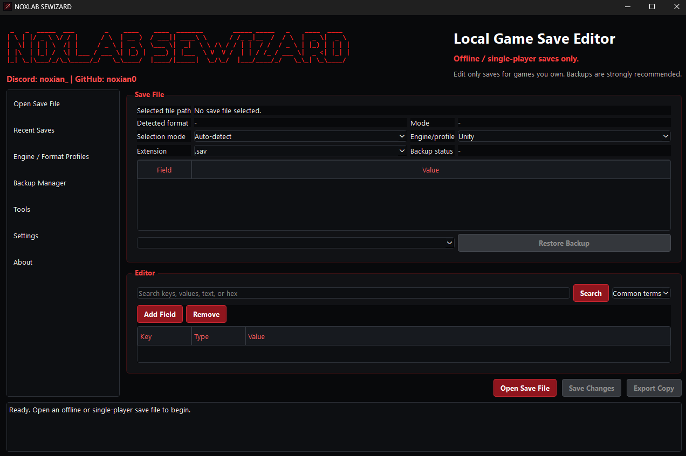

# NOXLAB SAVE EDITOR WIZARD

**NOXLAB SEWIZARD** is a local Windows game save editor and backup tool for personal offline and single-player saves.

It is designed to open a save file, detect safe editable formats, create a backup, show editable data, and save changes through a validation-first workflow.



## Features

- Local desktop app with no account, cloud, or internet requirement
- Dark red/black NoxLab app style
- Console-free Windows launcher and setup shortcuts
- Automatic backup before editing and before restore
- Recent save list stored locally
- Format detection for JSON, XML, INI/CFG, text, SQLite headers, compressed data, and binary data
- JSON tree editor with scalar value editing plus safe add/remove for object fields
- INI section/key editor
- XML tree preview with validated text editing
- Plain text editor
- Read-only hex viewer for binary or unsupported files
- Safe save flow using temporary files, validation, reopen checks, and atomic replace
- Backup manager with restore, delete, and open-folder actions
- Conservative read-only handling for unknown, encrypted-looking, compressed, and binary saves

## Supported MVP Formats

Editable in the first working version:

- `.json`
- `.xml`
- `.ini`
- `.cfg` when it uses normal INI section/key syntax
- `.txt` and other plain text saves

Read-only or guarded in the first working version:

- `.sav`, `.save`, `.dat`, `.bin`
- SQLite database files
- gzip/zlib/zip-like compressed saves
- RPG Maker MV/MZ compressed `.rpgsave` saves
- unknown binary or encrypted-looking data

Planned after MVP:

- RPG Maker MV/MZ LZ-string decode/re-encode support
- SQLite viewer
- Minecraft/NBT support through a real NBT library
- Diff preview for more formats
- Game-specific checksum profiles
- More engine/profile-aware editors

## Ethical Use Notice

Use this tool only with games you own and preferably with offline or single-player saves. Do not use it for online cheating, multiplayer manipulation, account tampering, anti-cheat bypass, DRM bypass, memory hacking, or modifying live game processes.

Editing save files can break saves or violate a game's rules. Some games use checksums, compression, or encryption. Unsupported saves are opened read-only so the app does not guess-write data it cannot safely validate.

## Backups

Backups are enabled by default and should stay enabled.

Before editing an editable save, the app copies the original file into the configured backup folder. Backup filenames use:

```text
game-save-name_YYYY-MM-DD_HH-MM-SS.bak
```

The backup manager can restore a selected backup, delete old backups, and open the backup folder.

## How To Run

### Requirements

For setup:

- Windows 10 or Windows 11
- PowerShell enabled
- Internet connection for the first setup run, because dependencies may need to be downloaded
- Python 3.10, 3.11, 3.12, or 3.13 installed, or permission for setup to install Python 3.12 for the current user
- Enough disk space for Python packages and the local `.venv`

For running the program after setup:

- No account required
- No cloud required
- No internet required after dependencies are installed
- The local `.venv` created by setup
- PySide6 installed from `requirements.txt`

Run the Windows setup script to install requirements, generate the icon, and create shortcuts:

```powershell
.\setup.bat
```

The setup creates:

- a local `.venv`
- a generated red/black app icon
- a desktop shortcut
- a shortcut inside the project folder
- shortcuts that launch with `pythonw.exe`, so the app opens as a window without a command prompt

Manual run:

```powershell
python -m venv .venv
.\.venv\Scripts\Activate.ps1
pip install -r requirements.txt
pythonw .\NOXLAB_SEWIZARD.pyw
```

If your system `python` points to a version without a PySide6 wheel, use a supported Python 3 release such as Python 3.11 or 3.12.

## How To Test

Run the non-GUI core tests:

```powershell
python -m unittest discover -s tests
```

The tests create temporary JSON, XML, INI, binary, and unsupported-looking save files, then verify detection, backup, restore, and safe-save validation.

## Release ZIP

The GitHub upload ZIP should be placed in:

```text
release\NOXLAB_SEWIZARD.zip
```

The release ZIP includes the setup scripts, launcher, source files, requirements, icon assets, README, screenshot, and license. Extract the ZIP first, then run `setup.bat`.

## How To Package Later

Packaging can be added later with PyInstaller:

```powershell
pip install pyinstaller
pyinstaller --name "NOXLAB SEWIZARD" --windowed --onefile src/main.py
```

Review the generated package before distribution and include this README, the license file, and any required notices.

## License

NOXLAB SEWIZARD uses a custom non-commercial license and terms of use. See the `LICENSE` file before using, modifying, or redistributing the project.
